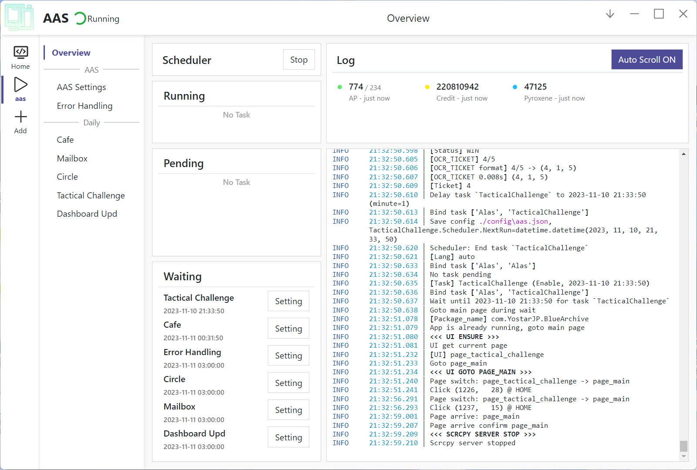

# ArisuAutoSweeper

**Blue Archive Automation Script**

**| English | [简体中文](README.md) |**

## Features

The script is still under active development. The following features have been implemented:

- [x] **Cafe** Claim rewards / Interact / Second floor
- [x] **Club** Claim AP
- [x] **Mailbox** Claim rewards
- [x] **Tactical Challenge** Claim rewards / Auto battle

_Currently only supports JP server._

## Relative projects

- [AzurLaneAutoScript](https://github.com/LmeSzinc/AzurLaneAutoScript): Azur Lane auto script
- [StarRailCopilot](https://github.com/LmeSzinc/StarRailCopilot): A bot for Honkai: Star Rail, based on the next
  generation of ALAS framework

Some Blue Archive auto scripts:

- [BAAuto](https://github.com/RedDeadDepresso/BAAuto): Blue Archive Automation Script
- [BlueArchiveAutoScript](https://github.com/pur1fying/blue_archive_auto_script): BAAS, used to implement Blue Archive
  automation
- [MBA](https://github.com/MaaAssistantArknights/MBA): BA assistant based on the new architecture of MAA

## Acknowledgements

Thanks to [6bir](https://github.com/6bir) for the icon design.

Thanks to [Alas](https://github.com/LmeSzinc/AzurLaneAutoScript) and [SRC](https://github.com/LmeSzinc/StarRailCopilot)
for the development framework.
