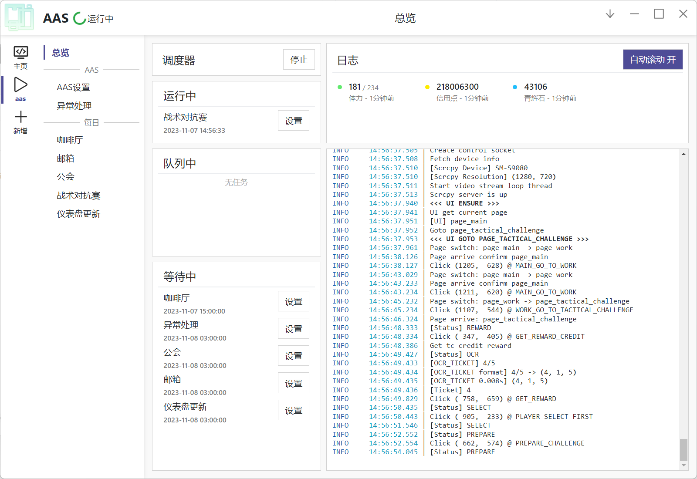

# ArisuAutoScript

**蔚蓝档案自动化脚本**

**| [English](README.en.md) | 简体中文 |**

## 功能

当前脚本还在活跃开发中，已经实现的功能有：

- [x] **咖啡厅** 领取奖励 / 互动 / 第二咖啡厅
- [x] **公会** 领取体力
- [x] **邮箱** 领取奖励
- [x] **战术对抗赛** 领取奖励 / 自动战斗

_目前仅支持日服。_

## 相关项目

- [AzurLaneAutoScript](https://github.com/LmeSzinc/AzurLaneAutoScript): 碧蓝航线自动化脚本
- [StarRailCopilot](https://github.com/LmeSzinc/StarRailCopilot): 崩坏：星穹铁道脚本，基于下一代Alas框架

## 鸣谢

感谢 [6bir](https://github.com/6bir) 为本项目设计的图标。

感谢 [Alas](https://github.com/LmeSzinc/AzurLaneAutoScript) 以及 [SRC](https://github.com/LmeSzinc/StarRailCopilot)
提供的开发框架。
